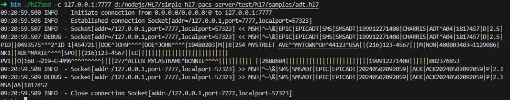
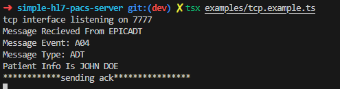

# raccoon-simple-hl7-server
The simple hl7 server for raccoon

Modified from [simple-hl7](https://github.com/hitgeek/simple-hl7)

## Usage

- You can find example code from: `examples/tcp.example.ts`

```typescript
import * as hl7 from "../apps/index";
import { MiddlewareHandle } from "../libs/connect/proto";
import { Hl7Request } from "../libs/connect/request";

let app = new hl7.Tcp();

app.use((req, res, next) => {
    console.log("Message Recieved From " + req.facility);
    console.log("Message Event: " + req.event);
    console.log("Message Type: " + req.type);
    next();
});

//create middleware
app.use((function (req, res, next) {
    //create middleware for certain message types
    if (req.type != "ADT" || req.event != "A04") {
        return next();
    }

    try {
        let pid = req.msg.getSegment("PID") as hl7.Hl7Segment;
        if (!pid) {
            throw new Error("No PID segment found");
        }
        let patient = pid.getComponent(5, 2) + " " + pid.getComponent(5, 1);

        console.log("Patient Info Is " + patient);
        next();
    } catch (e) {
        console.error(e);
        next(e);
    }
}) as MiddlewareHandle);

//Send Ack
app.use((function (req, res, next) {
    console.log("************sending ack****************");
    res.end();
}) as MiddlewareHandle);

app.use(function (err, req, res, next) {
    let msa = res!.ack!.getSegment("MSA") as hl7.Hl7Segment;
    msa.setField(1, "AR");
    res.ack!.addSegment("ERR", err!.message);
    res.end();
});

app.start(7777);
console.log("tcp interface listening on " + 7777);

```

### Receive Message Test
- For test receiving message, we using dcm4che's [hl7snd](https://github.com/dcm4che/dcm4che/blob/master/dcm4che-tool/dcm4che-tool-hl7snd/README.md) here
- Command:
```bash
hl7snd -c 127.0.0.1:7777 adt.hl7
```
- Result:


- Server's message:

